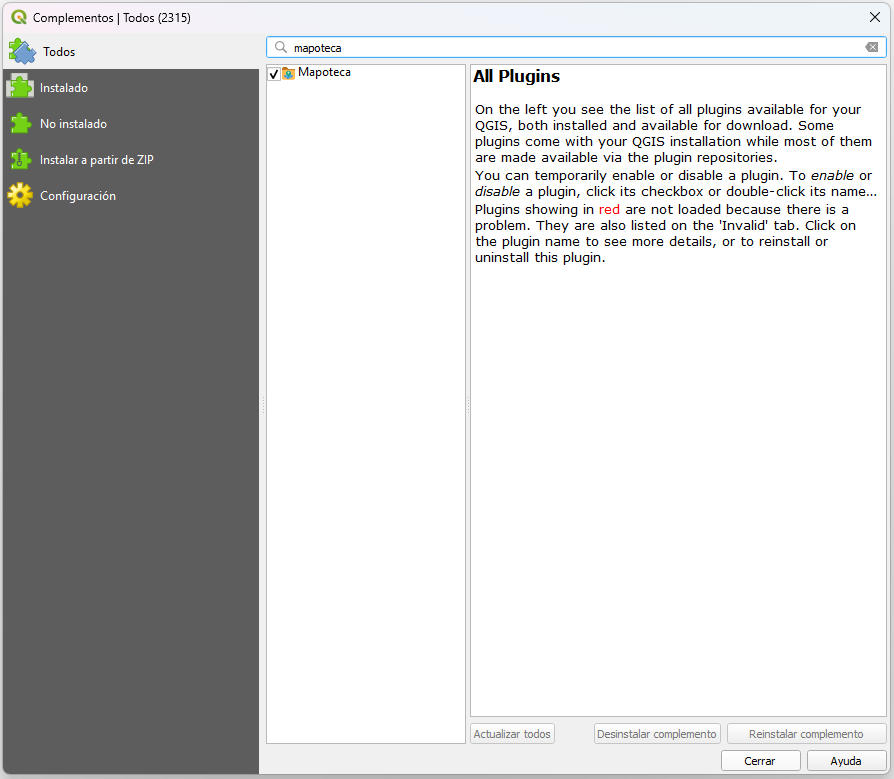
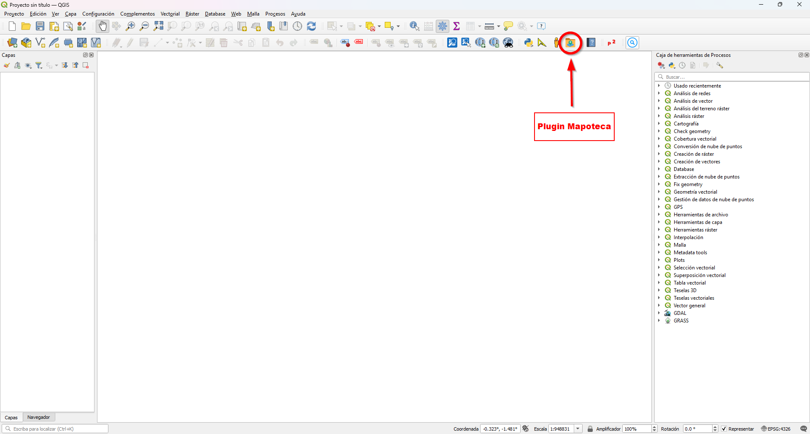
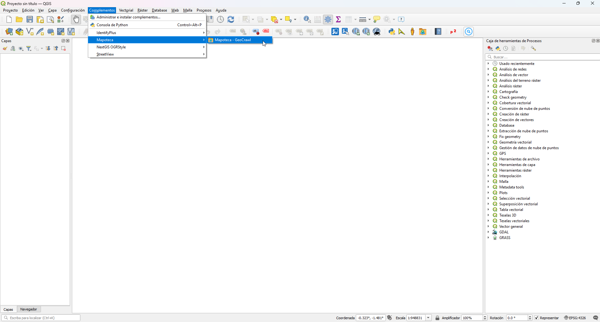
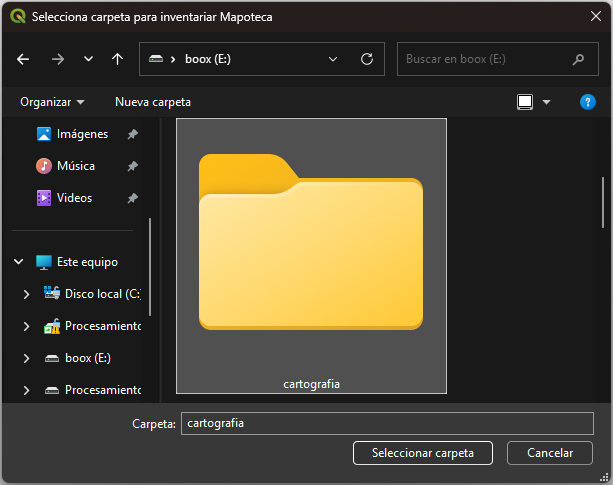
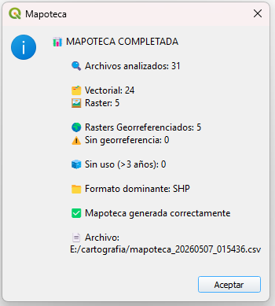
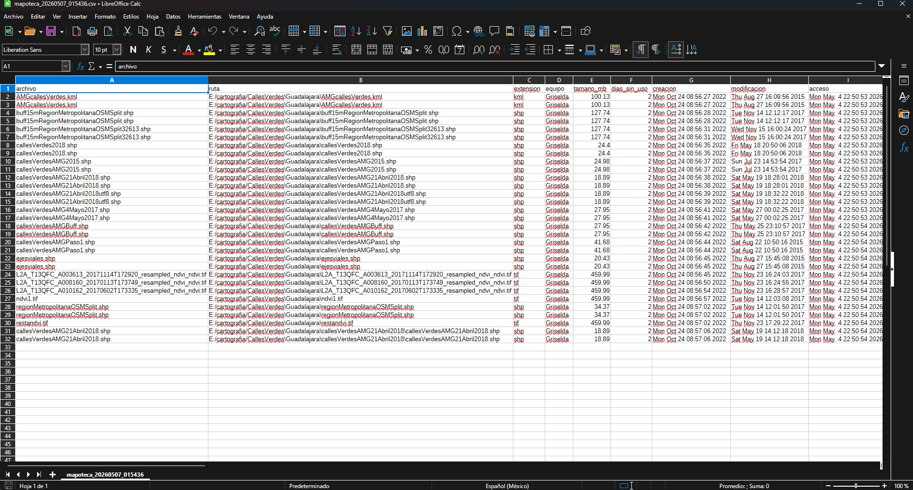
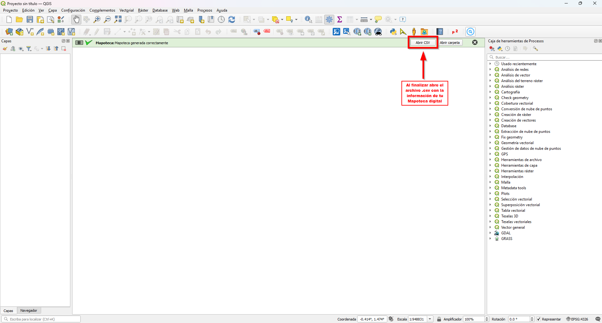

  

<h1 align="center">🗺️ Mapoteca 🗺️</h1>

  📊 Inventario y auditoría de datos geoespaciales con QGIS

  
  
  
  

---

## 🚀 ¿Qué es Mapoteca?

**Mapoteca** es un plugin de QGIS que analiza carpetas con datos geoespaciales y genera un inventario estructurado con información clave sobre:

- Tipos de datos GIS  
- Georreferenciación  
- Uso de archivos  
- Calidad de datasets  

👉 Convierte carpetas desorganizadas en información útil.

---

## ✨ Características

- 🔍 Escaneo automático de carpetas  
- 🗂️ Inventario de datos vector y raster  
- 🌍 Validación de georreferenciación  
- 📏 Cálculo de extensión espacial (extent)  
- 🧊 Detección de archivos sin uso (>3 años)  
- 📊 Resumen automático de resultados  
- 📄 Exportación a CSV  
- 🔗 Acceso directo al resultado desde QGIS  

---

## 🖼️ Capturas de pantalla

### 🔹 Instalación del plugin

  

---

### 🔹 Ejecuta Mapoteca desde el botón o desde el menú

  

  

---

### 🔹 Selecciona la ruta donde quieres que comience a inventariar inforamción geográfica, recuerda que entrará a todas las carpetas buscano información

  

---

### 🔹 Una vez terminado el proceso de inventariar la ruta elegida te dará un resumen de lo inventariado en el archivo .csv

  

  

---

### 🔹 Abre el .csv y analiza tu información

  

---

## 🤖 Sobre el desarrollo

Este plugin fue desarrollado con apoyo de inteligencia artificial (M365 Copilot – GPT‑5), lo que permitió acelerar el proceso de construcción y mejorar la calidad del código.

Toda la lógica, decisiones de diseño y validaciones fueron realizadas por el autor.

## 👤 Autor

**Juan José Del Toro Madrueño**  
🔗 https://github.com/jdeltoro1973
📧 jdeltoro@geomata.com.mx
📨 Telegram: https://t.me/mapoteca

